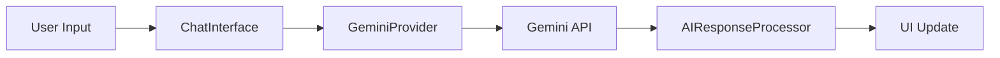

# Gemini AI Integration Documentation

## Overview
This document outlines the implementation plan and progress for integrating Google's Gemini AI into the personal finance dashboard. The integration enables AI-powered chat functionality and financial insights.

## Current Status
- [ ] Phase 1: Setup & Configuration
- [ ] Phase 2: Core Implementation
- [ ] Phase 3: Feature Implementation
- [ ] Phase 4: Testing & Deployment

## Architecture

### Components
- `GeminiProvider`: Context provider for Gemini AI services
- `ChatInterface`: Main chat UI component
- `MessageHistory`: Component for displaying chat history
- `AIResponseProcessor`: Utility for processing AI responses
- `FinancialInsightsEngine`: Integration layer between financial data and Gemini

### Data Flow


## Implementation Details

### Phase 1: Setup & Configuration

#### Environment Variables
```env
REACT_APP_GEMINI_API_KEY=your_api_key
REACT_APP_GEMINI_PROJECT_ID=your_project_id
REACT_APP_GEMINI_LOCATION=your_location
REACT_APP_MAX_TOKENS=your_max_tokens
REACT_APP_TEMPERATURE=your_temperature
```

#### Dependencies
```json
{
  "@google/generative-ai": "^0.1.0",
  "@react-query/core": "^3.39.3"
}
```

### Phase 2: Core Implementation

#### API Integration
- Gemini API wrapper location: `src/services/gemini.ts`
- Response types: `src/types/gemini.ts`
- Error handling: `src/utils/errorHandling.ts`

#### Context Management
- Provider location: `src/contexts/GeminiContext.tsx`
- Hook location: `src/hooks/useGemini.ts`
- Types location: `src/types/gemini.ts`

### Phase 3: Feature Implementation

#### Chat Features
- Real-time message streaming
- Message history persistence
- Typing indicators
- Error states
- Loading states

#### Financial Integration
- Transaction analysis
- Budget recommendations
- Investment insights
- Spending pattern analysis
- Goal tracking assistance

## Security Implementation

### API Security
- Rate limiting: 60 requests/minute/user
- Request validation
- Token encryption
- CORS configuration
- Input sanitization

### Data Privacy
- Message encryption
- PII handling
- Data retention: 30 days
- User consent required

## Error Handling

### Error Types
1. API Errors
   - Invalid API key
   - Rate limit exceeded
   - Invalid request format
   - Server errors

2. Network Errors
   - Connection timeout
   - Network unavailable
   - DNS resolution failed

3. Application Errors
   - Invalid input
   - Context processing failed
   - Response parsing failed

### Recovery Strategies
- Automatic retry (3 attempts)
- Exponential backoff
- Graceful degradation
- User feedback

## Testing Strategy

### Unit Tests
Location: `src/__tests__/unit`
- API wrapper functions
- Context providers
- Utility functions
- Component rendering

### Integration Tests
Location: `src/__tests__/integration`
- API communication
- State management
- Error handling
- Message flow

### E2E Tests
Location: `cypress/e2e`
- Chat functionality
- Financial analysis
- User interactions
- Error scenarios

## Performance Optimization

### Response Time Optimization
- Message caching
- Response streaming
- Lazy loading
- Request debouncing

### Resource Usage Optimization
- Memory management
- Connection pooling
- Asset optimization
- Bundle size optimization

## Monitoring & Analytics

### Metrics Tracked
- Response times
- Error rates
- Usage patterns
- User engagement

### Logging Implementation
- Error logging
- Usage logging
- Performance logging
- Security logging

## Required Manual Setup

### Google Cloud Platform
1. Create a new project in Google Cloud Console
2. Enable Gemini API for the project
3. Create API credentials
4. Set up OAuth 2.0 configuration
5. Configure API restrictions

### Netlify Setup
1. Add environment variables:
   - REACT_APP_GEMINI_API_KEY
   - REACT_APP_GEMINI_PROJECT_ID
   - REACT_APP_GEMINI_LOCATION
   - REACT_APP_MAX_TOKENS
   - REACT_APP_TEMPERATURE

2. Update build settings:
   - Add `@google/generative-ai` to dependencies
   - Configure build command
   - Set up environment variable access

### Firebase Setup
1. Update Firebase security rules for Gemini integration
2. Configure Firebase Authentication for API access
3. Set up Firestore collections for chat history
4. Enable necessary Firebase services

## Next Steps
1. Complete manual setup in Google Cloud Platform
2. Add environment variables in Netlify
3. Update Firebase configuration
4. Review and approve implementation plan
5. Begin phased implementation

## Support & Maintenance

### Troubleshooting
- API connection issues
- Authentication problems
- Performance concerns
- Security alerts

### Updates & Maintenance
- Regular security updates
- API version updates
- Performance optimization
- Feature enhancements

## Contact & Support
For implementation support:
- Google Cloud Support
- Netlify Support
- Firebase Support
- Development Team 