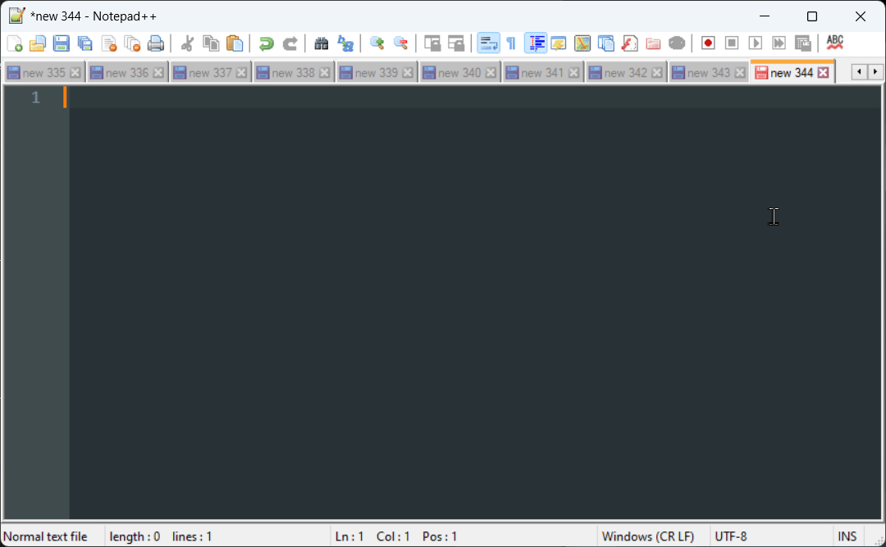

# Voice Typing Assistant

A lightweight Python desktop app for Windows that improves upon Windows Voice Typing (Win+H) by offering superior transcription accuracy and the ability to navigate between windows while recording, all while maintaining a simple, intuitive interface.

## Overview

How it works:
- Press Caps Lock to begin recording your voice (without activating Caps Lock)
- A recording indicator with audio level appears in the top-right corner
- Press Caps Lock again to stop recording and process the audio
- The audio is sent to OpenAI Whisper for transcription
- (optional) The transcribed text is further refined using a quick LLM model
- The transcribed text is inserted at your current cursor position in any text field or editor

## Features

### RecordingControls
- **Toggle Recording**: Caps Lock (normal Caps Lock functionality still available with Ctrl+Caps Lock)
- **Cancel Recording**: Click the recording indicator

### Tray Options/Settings
- Left-click tray icon to copy last transcription
- Recent Transcriptions: Access previous transcriptions, copy to clipboard
- Microphone Selection: Choose your preferred input device
- Settings:
  - Continuous Capture: Default recording mode. Record audio until the user stops it, send it all at once to OpenAI Whisper
  - Clean Transcription: Enable/disable further refinement of the transcription using Claude 3.5 Haiku
  - Auto-Stop on Silence: Automatically stop recording after a period of silence
- Restart: Quickly restart the application, like when its not responding to the keyboard shortcut

### Tray History
- Keeps track of recent transcriptions
- Useful if your cursor was in the wrong place at the time of insertion
- Quick access to copy previous transcriptions from system tray

## Technical Details
- Minimal UI built with Python tkinter
- OpenAI Whisper API for transcription (will support other providers in the future)
- For now, only tested on Windows OS and Python 3.8+

## Current Limitations
- ⚠️ Maximum recording duration of ~10 minutes per transcription due to OpenAI Whisper API's 25MB file size limit

## Setup/Installation - For Users

### Quick Start (Windows)
1. Make sure you have Python 3.8 or newer installed from [python.org](https://python.org)
2. Download this project by clicking the green "Code" button above → "Download ZIP"
3. Extract the ZIP file to a location of your choice
4. Double-click the `setup.bat` file to automatically:
   - Create a virtual environment
   - Install required packages
   - Set up your configuration file
5. When prompted, paste your OpenAI API key ([get one here](https://platform.openai.com/api-keys))
6. Double-click `voice_typing.pyw` to start the app
7. **Important**: Ensure the app's tray icon is visible by right-clicking the taskbar → "Taskbar settings" → "Select which icons appear on the taskbar" → Toggle on for Voice Typing Assistant (the tray icon is the main interface for settings and status)
8. **Recommended**: Right-click `voice_typing.pyw` → Send to → Desktop to create a shortcut

### Auto-start with Windows
To make the app start automatically when Windows boots:
1. Press `Win + R` on your keyboard
2. Type `shell:startup` and press Enter
3. Drag your `voice_typing.pyw` shortcut into this folder

### Updating the App
To update to the latest version:
1. Double-click `setup.bat`
2. Choose 'Y' when asked to check for updates
3. The tool will automatically:
   - Download the latest version
   - Preserve your settings and API keys
   - Update all dependencies
4. Restart the app if it was running

## Setup/Installation - For Developers

1. Clone the repo
2. Create a virtual environment using `python -m venv venv`
3. Run `venv\Scripts\activate` to activate the virtual environment
4. Run `pip install -r requirements.txt` to install all dependencies
5. Create a `.env` file based on `.env.example` by running `cp .env.example .env`
6. Set up your API keys:
   - Get an OpenAI API key from [OpenAI's API Keys page](https://platform.openai.com/api-keys)
   - (Optional) Get an Anthropic API key if you want to use the text cleaning feature
   - Add these keys to your `.env` file
7. Run the app by double-clicking `voice_typing.pyw`, and add a shortcut to your startup folder to launch automatically on system boot

## TODO
- [x] Do not send audio to OpenAI if the audio is silent or too short (<2 seconds)
- [x] Add visual status indicators via UI feedback indicator/overlay AND tray icon to show state (recording/processing/done/error)
- [x] Add microphone selection via system tray menu (currently locked to system default)
- [x] Manual (later, auto) retry option for failed transcriptions via tray menu and using overlay (especially important for longer recordings)
- [x] Add feature to auto-stop on complete silence, like when mic settings aren't configured properly.
- [x] Left clicking on the taskbar icon should copy the most recently transcribed message to clipboard.
- [x] Ability to restart the app via "Restart" option in the system tray menu.
- [x] Use a very fast and cheap LLM model to correct for grammatically wront sentence structures (due to pausing in speech) and ...-s
- [ ] Add support for other languages (currently only English is supported)
- [ ] Migrate to `uv` for dependency and environment management
- [ ] Some warning or auto-stop if recording duration is going to be too long (due to API limits)
- [ ] Migrate to using LiteLLM as wrapper to support other LLM providers.
- [ ] Handling for the `settings.json` file, so I'm not committing changes to mine.
- [ ] Review and validate setup and installation process
- [ ] Write tests for installation/update process
- [ ] Update and improve README.md
- [ ] Improved transcription accuracy via VLM for code variables, proper nouns and abbreviations using screenshot context and cursor position

## TODO - Future
- [ ] Customizable activation shortcuts for recording control
- [ ] Smart Capture: Record audio in 1-2 minute chunks with silence detection, process chunks with Whisper in background, then combine and clean results with an LLM

## Contributing

TBD, for now, just create a pull request and start a conversation.

## License

This project is licensed under the MIT License - see the [LICENSE](LICENSE) file for details.